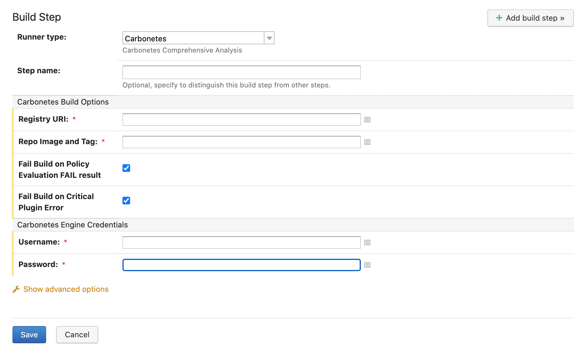
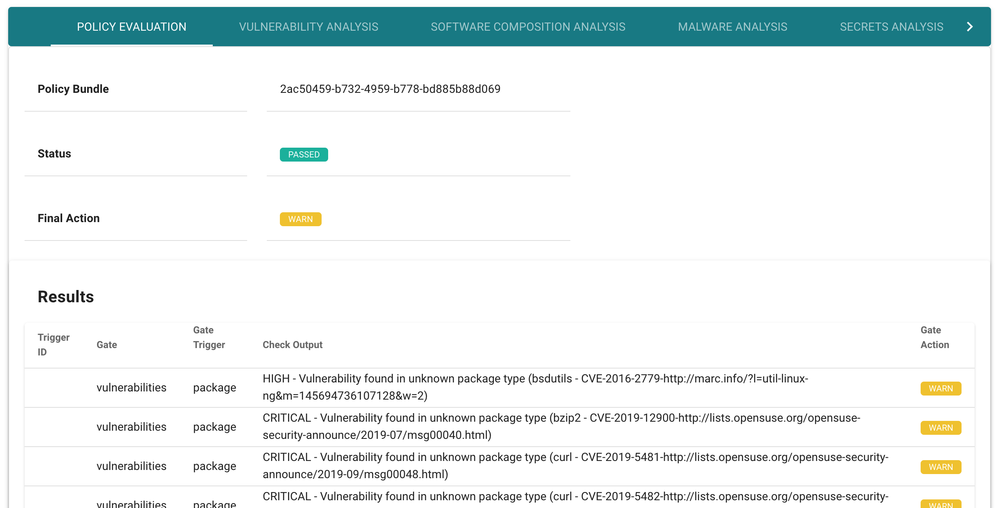

  

  

***

  

# Table of Contents

-  [Introduction](#introduction)
-  [Prerequisites](#prerequisites)
	-  [Managing Registries](#managing-registries)
-  [Installation](#installation)
-  [Configuration](#configuration)
  

# Introduction

**Carbonetes Team City Plug-in** provides comprehensive container analysis and policy evaluation as a fully managed service. Carbonetes analyzes your container images for native code vulnerabilities, software composition analysis (SCA). license types, bill of materials, malware, secrets. Carbonetes' powerful policy tool enables you to load standard policies or build , test and refine custom policies. It provides integrations with various container registries, CI/CD tools, as well as Slack and Jira.

**Carbonetes Team City Plug-in** seamlessly integrates comprehensive container analysis directly into your CI/CD pipeline. Upon committing your code, the Team City plug-in automatically initiates a comprehensive container analysis scan. The results of that scan are compared to the applicable policy to determine whether the container should build or not. The insight from the analysis and the policy evaluation are embedded right inside Team City making it easy to find and resolve issues without ever leaving Team City.
  

# Prerequisites
 - The plugin requires a valid [Carbonetes](https://carbonetes.com) credentials (email and password).
### Managing Registries
 > After signing in to [Carbonetes](https://carbonetes.com), on the left sidebar, click on Container Registries. Then supply required fields and click save.

# Installation

You can [download the plugin](https/our/plugin/link) and install it as an [additional plugin](https://confluence.jetbrains.com/display/TCDL/Installing+Additional+Plugins) for TeamCity 2018.2+.

#### How to install the Carbonetes plugin
1.  Log in to your Team City instance to install the Carbonetes plugin. Configure the Plugins list to Periodically check for plugin updates, in order to ensure regular automatic upgrades in the background.
    
2.  Navigate to the [JetBrains Plugins Repository](https://link/to/plugin), search for Carbonetes and from the Get dropdown list, select to install the plugin for your TeamCity installation.
    
3.  When the following prompt appears, click Install.

4.  When the installation ends, the Administration Plugins List loads, notifying the plugin has been uploaded.
    
5.  Ensure the plugin is enabled.

# Configuration
Add **Carbonetes Plugin** step to build configuration and adjust parameters you need

1. Add the step to a new or existing project:
	-   For new projects, after configuring the Git repo from which to create the build, activate the auto-detect feature to automatically identify relevant steps for your project build.
    
	-   For existing projects, navigate to edit the project build steps. When complete, Carbonetes Plugin appears in the list of suggested steps and the current test policy appears in the Parameters Description column: 
	
	
2. Navigate to configure the Carbonetes Plugin step as follows:
	- for existing projects, click Add build step to access the configuration screen.
	

  > **Registry URI** the registry URI that is managed in [Carbonetes](https://carbonetes.com)
	
  > **Repo Image** the image that will be scanned by the plugin.
	
  > **Fail Build on Policy Evaluation FAIL result** if this is checked, the result of the **build** will fail if the result of policy evaluation is failed. Otherwise, ignored.
	
  > **Fail Build on Critical Plugin Error** if this is checked, the result of the **build** will fail if the plugin encounters error. Otherwise, ignored.

3.  Configure the TeamCity fields (Runner type, Step name and Execute Step).

4. Configure Carbonetes Build Options and Carbonetes Engine Credentials. For more information see TeamCity configuration parameters.

5. Once configured, run the build. When the Carbonetes step ends successfully, you can navigate to the Carbonetes Report tab to view results within TeamCity and to navigate seamlessly to the Carbonetes Report UI for further action:
	

*Note : to be aligned in your CI/CD pipeline, make sure that you supply the same repository:imagetag that has been built within your pipeline stages. See below sample pipeline stages.* 

	
# License and Copyright

Copyright © 2020 Carbonetes

Licensed under [MIT License](LICENSE).